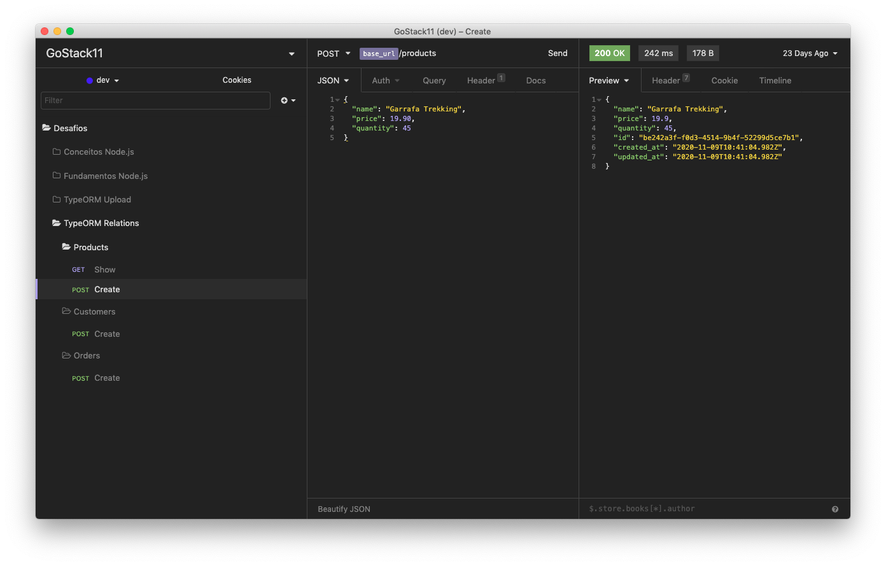

  

<h3 align="center">
  Desafio 09: Relacionamentos com banco de dados no Node.js
</h3>

  <a href="#rocket-sobre-o-desafio">Sobre o desafio</a>&nbsp;&nbsp;&nbsp;|&nbsp;&nbsp;&nbsp;
  <a href="#hammer_and_wrench-tecnologias">Tecnologias</a>&nbsp;&nbsp;&nbsp;|&nbsp;&nbsp;&nbsp;
  <a href="#memo-licença">Licença</a>

## :rocket: Sobre o desafio

Aplicação criada para o [Desafio 09](https://github.com/rocketseat-education/bootcamp-gostack-desafios/tree/master/desafio-database-relations) do Bootcamp GoStack 11 da Rocketseat.

Criação de uma nova aplicação para treinar Node.js junto ao TypeScript, incluindo o uso de banco de dados com o TypeORM, e relacionamentos ManyToMany. Essa é uma aplicação que permite a criação de clientes, produtos e pedidos, onde o cliente pode gerar novos pedidos de compra de certos produtos, como um pequeno e-commerce.

### Rotas da aplicação

Agora que você já está com o template clonado e pronto para continuar, você deve verificar os arquivos da pasta `src` e completar onde não possui código com o código para atingir os objetivos de cada rota.

- **`POST /customers`**: A rota deve receber `name` e `email` dentro do corpo da requisição, sendo o `name` o nome do cliente a ser cadastrado. Ao cadastrar um novo cliente, ele deve ser armazenado dentro do seu banco de dados e deve ser retornado o cliente criado. Ao cadastrar no banco de dados, na tabela `customers` deverá possuir os campos `name`, `email`, `created_at`, `updated_at`.

  

- **`POST /products`**: Essa rota deve receber `name`, `price` e `quantity` dentro do corpo da requisição, sendo o `name` o nome do produto a ser cadastrado, `price` o valor unitário e `quantity` a quantidade existente em estoque do produto. Com esses dados devem ser criados no banco de dados um novo produto com os seguintes campos: `name`, `price`, `quantity`, `created_at`, `updated_at`.

  

- **`POST /orders/`**: Nessa rota você deve receber no corpo da requisição o `customer_id` e um array de products, contendo o `id` e a `quantity` que você deseja adicionar a um novo pedido. Aqui você deve cadastrar na tabela `order` um novo pedido, que estará relacionado ao `customer_id` informado, `created_at` e `updated_at` . Já na tabela `orders_products`, você deve armazenar o `product_id`, `order_id`, `price` e `quantity`, `created_at` e `updated_at`.

  

- **`GET /orders/:id`**: Essa rota deve retornar as informações de um pedido específico, com todas as informações que podem ser recuperadas através dos relacionamentos entre a tabela `orders`, `customers` e `orders_products`.

  

## :hammer_and_wrench: Tecnologias

As seguintes ferramentas foram usadas na construção do projeto:

- [Node.js](https://nodejs.org/en/)
- [TypeScript](https://www.typescriptlang.org/)
- [TypeORM](https://typeorm.io/)
- [Insomnia](https://insomnia.rest/)

## :memo: Licença

Esse projeto está sob a licença MIT. Veja o arquivo [LICENSE](LICENSE) para mais detalhes.
